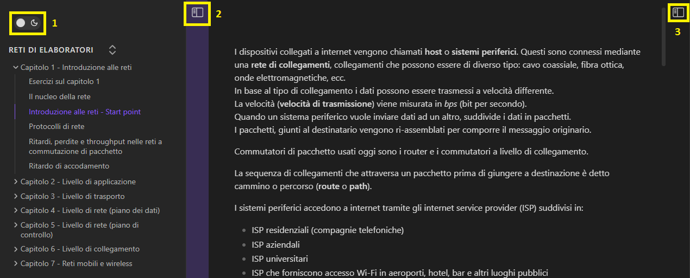
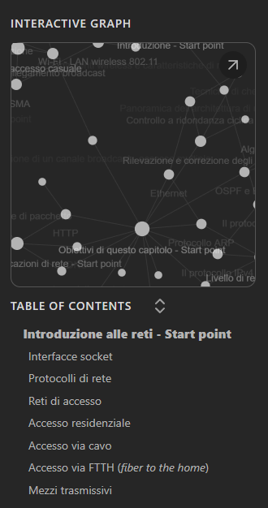

# Appunti per corsi di laurea in informatica

### Cos'è questo repository?
Questo repository contiene degli appunti, raggruppati per corso e capitoli/sezioni utili a persone che frequentano corsi di laurea in informatica. Gli appunti sono stati scritti con Obsidian, da me: Davide Falco, ma vengono forniti sotto forma di file HTML.
Le materie trattate fanno parte della laurea in informatica dell'Università degli studi di Torino, tuttavia potrebbero combaciare con diverse lauree italiane dello stesso settore. Gli appunti prendono spunto soprattutto dai libri consigliati dai docenti, i contenuti sono stati poi arricchiti da ricerche che ho dovuto effettuare per comprendere bene le nozioni affrontate.
### Come posso accedere agli appunti?
Puoi scaricarli direttamente da questo repository ed eseguirli nel tuo browser.
Oppure puoi accedere al sito, senza scaricare niente sul tuo computer: [link](https://davidefalco.github.io/appunti-informatica/).
### Guida alla navigazione degli appunti
Per chi conosce Obsidian, la navigazione è identica a quella dell'applicazione stessa per computer.
Per chi non lo conoscesse, di seguito una breve guida all'uso.  
Se scorrete più avanti nella pagina, troverete dei link che vi rimandano a dei _punti di ingresso_ alle pagine con gli appunti per ciascun capitolo/parte della materia.
Una volta aperti tali link vi troverete di fronte una schermata come quella che segue.  

- Il riquadro numero 1 serve per abilitare/disabiltiare la modalità scura.
- Il riquadro numero 2 serve per aprire/chiudere la sidebar a sinistra.
- Il riquadro numero 3 serve per aprire/chiudere la sidebar a destra.

La sidebar di sinistra elenca tutti i capitoli nella cartella della materia selezionata. 
Mentre la sidebar a destra (utlima foto) mostra il grafo tipico di Obsidian. 
Il grafo fornisce una visuale grafica di come sono collegati i documenti/argomenti tra di loro.
Tra una pagina e un'altra vi imbatterete sicuramente in dei link che vi collegano con altri argomenti.
La sidebar a destra contiene anche un riassunto dei contenuti della pagina in cui vi trovate.

### Degni di nota
Gli appunti verranno, per quanto mi è possibile nel tempo, continuamente aggiornati e sistemati, da un punto di vista organizzativo, ma anche ortografico e sintattico. Vi prego di perdonarmi per eventuali errori ortografici e/o grammaticali.
# Appunti disponibili al momento</h1>
### Reti di elaboratori
**CFU corso**: 12 
**Docenti**: Matteo Sereno, Michele Garetto 
**Libro**: Reti di calcolatori e internet - un approccio top-down (autori: James F. Kurose, Keith W. Ross) 
**Capitolo 1**: [introduzione alle reti](https://davidefalco.github.io/appunti-informatica/reti-di-elaboratori/capitolo-1-introduzione-alle-reti/introduzione-alle-reti-start-point.html) 
**Capitolo 2**: [livello di applicazione](https://davidefalco.github.io/appunti-informatica/reti-di-elaboratori/capitolo-2-livello-di-applicazione/architetture-delle-applicazioni-di-rete-start-point.html) 
**Capitolo 3**: [livello di trasporto](https://davidefalco.github.io/appunti-informatica/reti-di-elaboratori/capitolo-3-livello-di-trasporto/livello-di-trasporto-start-point.html) 
**Capitolo 4**: [livello di rete (piano dei dati)](https://davidefalco.github.io/appunti-informatica/reti-di-elaboratori/capitolo-4-livello-di-rete-(piano-dei-dati)/livello-di-rete-start-point.html) 
**Capitolo 5**: [livello di rete (piano di controllo)](https://davidefalco.github.io/appunti-informatica/reti-di-elaboratori/capitolo-5-livello-di-rete-(piano-di-controllo)/introduzione-start-point.html) 
**Capitolo 6**: [livello di collegamento](https://davidefalco.github.io/appunti-informatica/reti-di-elaboratori/capitolo-6-livello-di-collegamento/obiettivi-di-questo-capitolo-start-point.html) 
**Capitolo 7**: [reti mobili e wireless](https://davidefalco.github.io/appunti-informatica/reti-di-elaboratori/capitolo-7-reti-mobili-e-wireless/introduzione-start-point.html)  
_Accedendo a uno dei capitoli qualsiasi, dalla navigazione della sidebar di sinistra, si riesce ad accedere a tutti gli altri. All'interno di ogni capitolo sono presenti esercizi (in continuo aggiornamento)._

### Sicurezza
**CFU corso**: 6 
**Docenti**: Francesco Bergadano 
**Libri**: Sicurezza dei computer e delle reti (William Stallings), Computer and Internet Security - a hands-on approach (Wenliang Du) 
_Per redigere questi appunti (dato il contenuto striminzito delle slide) ho dovuto approfondire gli argomenti su altri testi come: Building Internet Firewalls and Web Security e Network Security Essentials - applications and standards e il libro di reti (citato sopra)_  
**Parte 00**: [cifrari simmetrici](https://davidefalco.github.io/appunti-informatica/sicurezza/00-cifrari-simmetrici/cifrario-start-point.html) 
**Parte 01**: [DES e AES](https://davidefalco.github.io/appunti-informatica/sicurezza/01-des-e-aes/cifrari-a-flusso-e-cifrari-a-blocchi-start-point.html) 
**Parte 02**: [cifrari asimmetrici](https://davidefalco.github.io/appunti-informatica/sicurezza/02-cifrari-asimmetrici/introduzione-start-point.html) 
**Parte 03**: [computer security e internet security](https://davidefalco.github.io/appunti-informatica/sicurezza/03-network-security-e-software-security/sicurezza-delle-reti-e-dei-software-start-point.html) 
_Accedendo a uno dei capitoli qualsiasi, dalla navigazione della sidebar di sinistra, si riesce ad accedere a tutti gli altri, tra di esse è disponibile una cartelle "Esami vecchi" in cui sono contenute vecchie domande di esami e possibili soluzioni (da me elaborate, in continuo aggiornamento)._

### Sviluppo applicazioni software (ingegneria del software)
**CFU corso**: 9 
**Docenti**: Matteo Baldoni, Claudia Picardi (docente di laboratorio) 
**Libri**: Applicare UML e i pattern: analisi e progettazione orientata agli oggetti (Craig Larman) 
**Parte 00**: [Processi per lo sviluppo software](https://davidefalco.github.io/appunti-informatica/sviluppo-applicazioni-software/00-processi-per-lo-sviluppo-software/processo-software-start-point.html) 
**Parte 01**: Unified Process 
- [A) Iterazione 0 - Analisi dei requisiti](https://davidefalco.github.io/appunti-informatica/sviluppo-applicazioni-software/01-unified-process/a-iterazione-0-analisi-dei-requisiti/unified-process-(up)-start-point.html)
- [B) Altri requisiti](https://davidefalco.github.io/appunti-informatica/sviluppo-applicazioni-software/01-unified-process/b-altri-requisiti/altri-requisti-start-point.html)
- [C) Storie utente](https://davidefalco.github.io/appunti-informatica/sviluppo-applicazioni-software/01-unified-process/c-storie-utente/introduzione-start-point.html)
- [D) Iterazione 1 - Fase di elaborazione](https://davidefalco.github.io/appunti-informatica/sviluppo-applicazioni-software/01-unified-process/d-iterazione-1/requisiti-per-l'iterazione-1-start-point.html)
- [E) Iterazione 1 - Verso la fase di progettazione](https://davidefalco.github.io/appunti-informatica/sviluppo-applicazioni-software/01-unified-process/e-iterazione-1-verso-la-progettazione/architettura-logica-e-gli-strati-start-point.html)   

**Parte 02**: [Unified Process: Pattern Grasp e GoF](https://davidefalco.github.io/appunti-informatica/sviluppo-applicazioni-software/02-pattern-grasp-e-gof/introduzione-start-point.html) 
**Riassunto**: [solo teoria, esclusi GRASP e GoF](https://davidefalco.github.io/appunti-informatica/sviluppo-applicazioni-software/da-sapere-per-esame.html)  
_Navigando tra le cartelle di questa materia vi potreste imbattere in due Canvas. In Obsidian i Canvas sono come delle lavagne bianche in cui si possono attaccare delle schede. Una è proprio quelle sul riassunto di teoria, l'altro canvas è una chematizzazione dei pattern (incompleta per i GRASP).  Nota: i pattern ci sono tutti sia i GRASP che i GoF, dei GRASP manca solo lo schema riassuntivo.  Nota (2): nei canvas potete zoomare (anche tantissimo) con la rotella del mouse o zoomando con le dita sul touchpad (non server CTRL e +/-). Quando il cursore si trova dentro la scheda di vostro interesse basta scrollare normalmente per scorrere all'interno della scheda. Per spostarvi all'interno del canvas basta fare click con il tasto sinistro e spostarvi verso la zona di vostro interesse._

### Se ti piace il mio lavoro, offrimi un caffè
 

